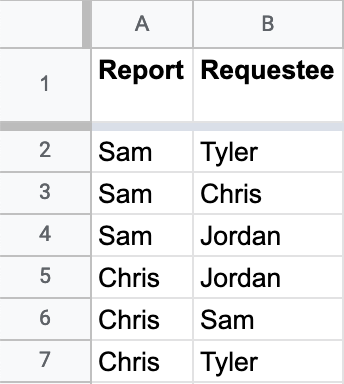
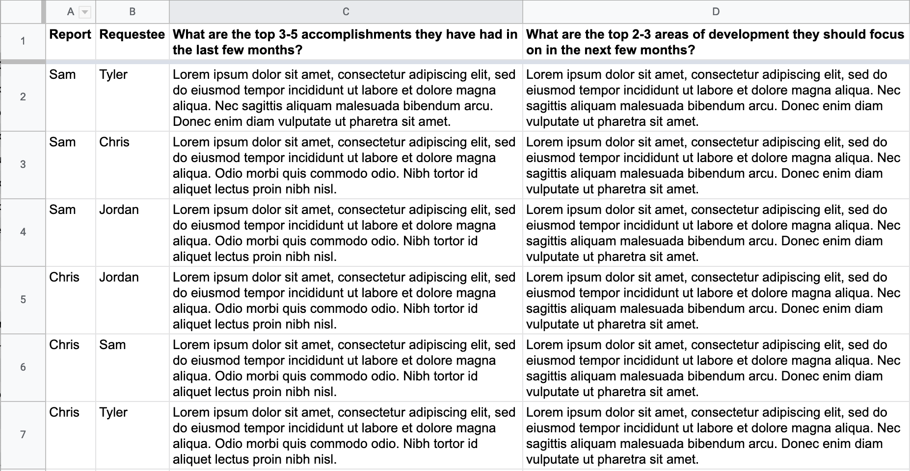

Gather and share feedback from your direct report’s peers. Celebrate with them what others see as their accomplishments and work together to improve areas identified by their peers.

> NOTE While this post is framed from the perspective of an engineering manager collecting peer feedback on reports, it isn’t hard to apply much of this post to other managerial roles or to get peer feedback on yourself (which I have done).

## Introduction

As an engineering manager I believe it is important to collect peer feedback when I do reviews with my direct reports (reports). 
This creates an opportunity for my reports to receive feedback from their peers through me (their manager) and it also helps me evaluate my assessment of the report.

Ideally my report's peers would share open and constructive feedback on my report with the report and I in an timely manner. Unfortunately, while that does happen on rare occasion, I find that if I want peer feedback, I have to request it.

Let me share with you how I request peer feedback for my reports and what I do with said feedback.

## Requestees
First, I collect the names of those I want feedback on. This is rather easy as I just write down the names of all my reports. If you need to use something like Workday to find out who they are, you may have things other than gathering peer feedback to worry about.

Secondly, I create a broad pool of candidates who can reach out for feedback. This pool is usually includes all the members of the team and members of other teams that my reports have been collaborating with in the desired feedback timeframe. Ideally, the pool has a variety of experience and job functions to increase the chances of getting a breadth of perspectives.

I then allocate roughly 3-4 members of that pool (requestee) to each report. When allocating, I ensure they actually interact with the person for which I’m requesting feedback. I also make sure that I don’t request feedback from a requestee for more than 3 reports. I don’t want to burden the requestee. This could lead to poor quality feedback or, worse, no feedback at all (or more worse, conflict). 

I manage all of this in a spreadsheet, like this:


## Request
After I have the requestees, I then populate an email template for each report.

Subject: 
```
Request for Peer Feedback
```

Body:
```
Hi! You’ve been selected as someone who has interfaced with <Direct Report> on the <Direct Report’s Team Name>. I would greatly appreciate it if you could take a minute to provide some peer feedback, specifically the following questions:

* What are the top 3-5 accomplishments they have had in the last few months?
* What are the top 2-3 areas of development they should focus on in the next few months?

Please return this feedback to me by <Due Date>, thanks!

- Josh
```

I take these populated templates and send an email to the requestees, making sure that their emails are in the BCC line.

I make the `Due Date` one week from when I send the request. I send the request for feedback 3 weeks before I plan to have reviews, with the hopes of having the feedback back one week before I do the reviews. 
If you did the math there, it doesn’t quite check out. There is a week unaccounted for in between the request date, the due date, and when to have the responses. That is because I assume most people will forget or be late when providing feedback. So, I pad the dates accordingly. I set the original due date a week after I send the request and I send a reminder a week before I hope to have the feedback.

Here is an overview of the request timeline:
* 3 weeks before the review - Request peer feedback with the due date set in a week
* 2 weeks before the review - Send a reminder to requestees with outstanding feedback to respond within a week

As feedback comes in, I thank the requestee and move the feedback from the emails into _the_ spreadsheet:


## Share
A week before conducting the review, I take the feedback for an individual, pseudo anonymize the feedback, place the feedback in said person’s shared review document, and notify them the feedback is available. You don’t need a shared review document, the point is to share the feedback with the report.

## Discuss
During the review, the report and I **discuss** the feedback. We don’t read through the feedback in the meeting, that should have been done ahead of time. When discussing, we try to find common themes, areas to improve, and celebrate the recognition. Notes and action items, with an assignee, are made as needed.

For some requestees, who are also my report, I recommend they give specific feedback directly to individuals. They’ve already done the hard work of crafting the feedback, share it! It is important to have a culture of direct, constructive, and timely feedback between team members.

## Follow up
A month and a half after discussing feedback, I reach back out to the requestees to follow up on the prior feedback they had provided:
```
Hi! <Time of Request> you provided feedback on <Direct Report> from the <Direct Report’s Team Name>. I appreciate that you took the time to provide the feedback and your feedback <Time Frame>. 

I want to check-in with you to see if you have seen any changes related to your feedback, specifically the “areas of development”. Development takes time and I will use your check-in feedback to better gauge progress and guide next steps.

Please return this feedback to me by <Due Date>, thanks!

- Josh

P.S. As a reminder, here is the feedback you provided:

<Feedback>
```

The response rate for the follow up has been historically less than the initial feedback. I usually only push on those requestees that had mentioned areas of development they had mentioned and the report has actively been working on to improve.

As follow up feedback trickles in, I share it with the report and we discuss in our recurring 1-on-1s. 

## Areas of Development
I’m always looking for ways to improve the quality of feedback and the response rate. Thankfully, I have had good success with the questions (with some coaching on what makes good feedback with some individuals). The area where I struggled the most was with the response rate. 

Email is _great_, but there are some other tools that can help with the response rate:
* Use a Google Form - A Google Form would add more structure to the feedback (as opposed to a free form email), can be shared outside email, and has the added bonus of populating the results in a spreadsheet for me.
* Schedule a Calendar event with the requestee for the date the feedback is due - Emails get lost in the shuffle and a calendar event would serve as another reminder to the requestee.

Another improvement I’d like to make, depending on the circumstances, is to not anonymize the feedback. I think this is is more transparent and one more step towards encouraging direct feedback. If I were to do this, I would update the templates to make this lack of anonymity explicit to the requestee.

## Conclusion
If you are managing others and aren’t collecting and sharing peer feedback yet, I’d encourage you to do so. Try out how I shared here or try something that is better suited for you. Either way, peer feedback can be a helpful way to help your reports improve in their career.

If you have a way you currently request peer feedback or have suggestions on how I can improve, please share in the comments below.
