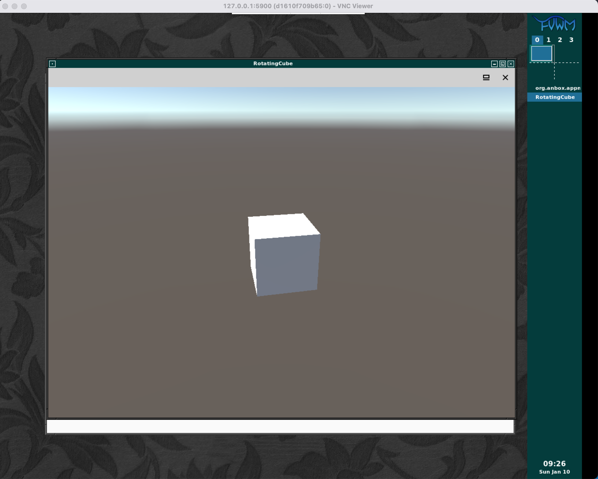

Steps to run a Unity Android Build (APK) on Android (Anbox) in Docker ([AinD](https://github.com/aind-containers/aind)) on a Mac. Running Android builds in Docker can be tool for testing locally and adapted to running in the cloud. 

> PRO TIP Remember, while virtualization has its use cases, it is not an absolute substitute for testing on actual hardware. Put another way, if you don’t test on the actual device you’re going to release on, you’re probably going to have a bad time.  

> DISCLAIMER I formerly worked at Unity. While I no longer work there, I still have a vested interest in their success.

## Overview
1. [Prereqs](#prereqs)
2. [Build Unity Project](#build-unity-project)
3. [Start AinD](#start-aind)
4. [Run Unity Build (APK)](#run-unity-build-apk)
5. [Shutdown](#shutdown)
6. [Cleanup](#cleanup)

## Prereqs
- Clone _the_ project [GitHub - ozbe/aind-unity-poc: Steps to run a Unity Android Build in Android in Docker (AinD) on a Mac.](https://github.com/ozbe/aind-unity-poc)
- [Unity](https://unity3d.com/get-unity/download) with Android Build Support - Tested with version 2018.4.30f1 (LTS)

> NOTE You may think you’re going to use 2019.3+ for this walkthrough, don’t. It looks  support for x86 was dropped in 2019.3  in favor of ARM64. Source: [Android Support Update: 64 bit and App Bundles Backported to 2017.4 LTSUnity 2017.4 LTS  - Unity Technologies Blog](https://blogs.unity3d.com/2019/03/05/android-support-update-64-bit-and-app-bundles-backported-to-2017-4-lts/).   

- [VirtualBox](https://www.virtualbox.org/wiki/Downloads) - Tested with version 6.1.16
- [Vagrant](https://www.vagrantup.com/downloads.html) - Tested with version 2.2.14
- [Android Studio ](https://developer.android.com/studio/) - Tested with version 
- [VNC Viewer](https://www.realvnc.com/en/connect/download/viewer/) - Tested with version 6.20.817

## Build Unity Project
The example Unity project shows a rotating cube on the screen for approximately 2 seconds and then exits. 

To an Android build of the project, follow the following steps, from the project root
1. Open Unity project `./RotatingCube`
2. `File` > `Build Settings`
3. `Android`
4. Use all defaults
5. `Build`
6. Save APK as `./apk.d/rotatingcube.apk`

We now have a build file (APK) that we can run with AinD.

## Start AinD
AinD requires some modules that are not available on macOS. To overcome these shortcomings, we will run AinD in an Ubuntu VM (Ubuntu being the version AinD’s author has tested AinD on).

To simplify creating and provisioning the VM, the project provides a `Vagrantfile` to do the heavy lifting for us.

In a terminal, at the project root., start the VM
```
$ vagrant up
```

After starting the VM, SSH into the VM
```
$ vagrant ssh
```

Inside the VM, we can run AinD with Docker
```
$ sudo docker run \
   --rm \
   -td \
   --name aind \
   --privileged \
   -p 5900:5900 \
   -v /vagrant/apk.d/:/apk.d/ \
   -v /lib/modules:/lib/modules:ro \
	aind/aind:0.0.3
```

There is a lot going on it the previous command. If you’re interested, let’s go break down each line:
1. `sudo docker run` execute the Docker run command as root
2. `--rm \` remove the container when it stops
3. `-td \` allocate a pseudo-TTY and run the container in the background
4. `--name aind \` name the container `aind`
5. `--privileged \` Give the extended privileges required by AinD to this container
6. `-p 5900:5900 \` publish port 5900 to the host to connect via VNC
7. `-v /vagrant/apk.d/:/apk.d/ \` mount the projects `apk.d` folder to the container’s  `apk.d` folder, so our APK will be loaded automatically 
8. `-v /lib/modules:/lib/modules:ro \`Required by AinD
9. `aind/aind:0.0.3` AinD image to run (0.0.3 being the latest version at the time of writing and using `latest` isn’t )

After starting the AinD container we should wait for the container to report ready.  Tail the container logs and look for `Ready` (in ASCII art letters)
```
$ sudo docker logs -f aind
```

Now we have AinD running and our `rotatingcube.apk` should be loaded.  Before we move onto running APK, let’s get the VNC password we’ll need for the next step
```
sudo docker exec aind cat /home/user/.vnc/passwdfile
```

Copy the VNC password output and let’s run the APK.

## Run Unity Build (APK)
To run the  `rotatingcube.apk`, ensure AinD is started and then
1. Open VNC Viewer
2. Connect to address: `127.0.0.1:5900` (ignore any unencrypted errors)
3. Enter the password you copied from the last step of [Start AinD](#start-aind)
4. Connect
5. When you connect to the server, the `Anbox Application Manager` window should be open
6. Double-click on `RotatingCube`
7. RotatingCube should appear for approx. 2 seconds and then close



There you go. You ran a Unity Android build in Docker. 

To wrap up, we will shut the container and VM down and clean up the resources. That is unless you want to go on your own and try to run other APKs. For which you are on your own, though you have the comments to discuss.

## Shutdown
In the VM, stop the AinD
```
$ sudo docker stop aind
```

On the host, shutdown the VM
```
$ vagrant halt
```

## Cleanup
In the terminal on host, destroy the VM
```
$ vagrant destroy -f
```

## Conclusion
Now that you have run the example project’s Unity Android build in Docker, I’d recommend you check out [GitHub - aind-containers/aind: AinD: Android in Docker. Ain’t an emulator.](https://github.com/aind-containers/aind) to get guidance on how you can run the same build or another in the **cloud**.

