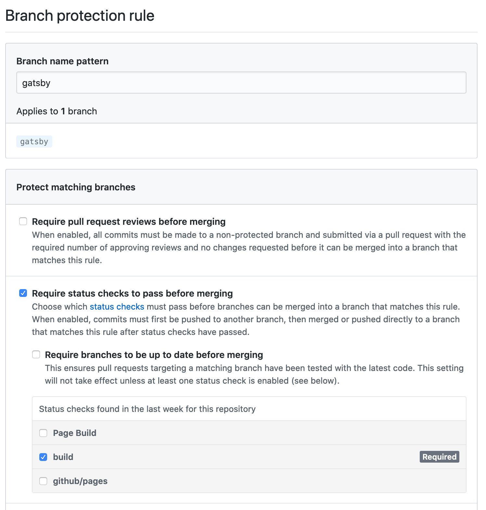

Automatically run Gatsby build on feature branch pushes and prevent feature branches with broken builds from merging into the release branch.

## tl;dr
You can see the code changes here [Verify Gatsby build succeeds on branches by ozbe · Pull Request #2 · ozbe/ozbe.github.io · GitHub](https://github.com/ozbe/ozbe.github.io/pull/2)

## Background
While working on adding RSS to ozbe.io in a feature branch, I nearly merged some changes that would have broken the build in the release branch. As discussed in [ozbe.io Rises](https://ozbe.io/ozbe-io-rises/), changes pushed to the release branch, `gatsby`, are automatically built and published, that includes changes that come from a merge request.

Thankfully the GitHub Actions workflow would have stopped on the broken build and not published the broken changes. The worst that could happen would be that I have to make a hot-fix and hang my head in shame.

> *TANGENT* At a prior company I worked at, when you broke production, you were given a toilet brush that we passed around. It was intended to say, “Go clean the toilets.” Don’t worry though, the toilet brush was never used; merely symbolic. 

## Overview
We are going to have to make two changes to avoid merging build breaking changes into the release branch. First, we are going to have to run the build for all branches. Secondly, we are going to have to protect the release branch from the build breaking changes.

## Pre-reqs
This post assumes a basic understanding of [GitHub Actions](https://help.github.com/en/actions)  and [Gatsby](https://www.gatsbyjs.org/). If you know of GitHub Actions workflows and that Gatsby builds webpages, you should be good. 

## Build all the branches
[ozbe.github.io](https://github.com/ozbe/ozbe.github.io) uses [enriikke/gatsby-gh-pages-action](https://github.com/enriikke/gatsby-gh-pages-action/blob/master/README.md) to build and publish the `gatsby` branch. Here is the repo’s publish workflow that uses the action:

```
# .github/workflow/publish.yml

name: Gatsby Publish

on:
  push:
    branches:
      - gatsby

jobs:
  build:
    runs-on: ubuntu-latest
    steps:
      - uses: actions/checkout@v1
      - uses: enriikke/gatsby-gh-pages-action@v2
        with:
          access-token: ${{ secrets.ACCESS_TOKEN }}
```

We want to keep the same behavior for the `gatsby` branch and we also want to run the build part for all other branches when they are pushed. The difference being, *we don’t want to publish feature branches*. Maybe the GitHub Action we are already using already can help us out?

//giphy spinning batman logo/

Navigating over to [enriikke/gatsby-gh-pages-action](https://github.com/enriikke/gatsby-gh-pages-action/blob/master/README.md), there is the option `skip-publish` that looks very relevant to what we want to do. Here is an excerpt from the README:

```text
*skip-publish*: Builds your Gatsby site but skips publishing by setting it to true, effectively performing a test of the build process using the live configuration. Provided as an  [input](https://help.github.com/en/actions/automating-your-workflow-with-github-actions/creating-and-using-encrypted-secrets#using-encrypted-secrets-in-a-workflow)  Defaults to *false*
```

Perfect. We can use this /knob/ to control whether or not a branch is published. 

We could fork the publish workflow into a separate build workflow. It would build any branch that isn't the release branch and have `skip-publish` set to `true`. But let’s try to avoid that duplication and use another GitHub Actions feature: expressions. 

[Expressions](https://help.github.com/en/actions/reference/context-and-expression-syntax-for-github-actions) in GitHub Actions allow us to programmatically set variables in a workflow. An expression looks like `${{ <expression> }}`. If you’ve used something like [Handlebars](https://handlebarsjs.com/) or another templating technology, this should be fairly familiar to you. 

There is already an example of an expression in the `publish.yml` above:
```
# ...
    access-token: ${{ secrets.ACCESS_TOKEN }}
# ...
```

Within an expression we have access to various contexts. These contexts enable us to access various information about the workflow, environment, and [more](https://help.github.com/en/actions/reference/context-and-expression-syntax-for-github-actions#github-context).

For our purposes, we want to set `skip-publish` to `true` when the workflow is running for the `gatsby` branch and `false` for all other branches.  Looking through the documentation we can see that the `github` context has a property named `ref`. `github.ref`equals “[t]he branch or tag ref that triggered the workflow run.” 

We don't know the names of all our feature branches, so we will write a boolean expression that will return true for all branches other than the release branch. Here is the expression:

```
github.ref != 'refs/heads/gatsby'
```

> *NOTE* If you just went, “Why is it `refs/heads/gatsby` and not `gatsby`?” Let me refer you to [Git - Git References](https://git-scm.com/book/en/v2/Git-Internals-Git-References) and [Git Refs | GitHub Developer Guide](https://developer.github.com/v3/git/refs/) to learn more about Git references. For now, just trust me that we need the `refs/heads/`.

We now have our /knob/ and we have our boolean expression, so lets add them to `publish.yml`

```
# ...
jobs:
  build:
    runs-on: ubuntu-latest
    steps:
      - uses: actions/checkout@v1
      - uses: enriikke/gatsby-gh-pages-action@v2
        with:
          access-token: ${{ secrets.ACCESS_TOKEN }}
          skip-publish: ${{ github.ref != 'refs/heads/gatsby' }}
```

Great! Now `gatsby-gh-pages-action` will only publish on our release branch.

If we tried to push code to a branch with this workflow, we’d notice that the workflow doesn’t run. That is because we need to change one more thing in our workflow. 

Right now the publish workflow only runs on pushes to the `gatsby` branch:

```
on:
  push:
    branches:
      - gatsby
```

A quick visit to the [GitHub Action Workflow Filter pattern cheat sheet](https://help.github.com/en/actions/reference/workflow-syntax-for-github-actions#filter-pattern-cheat-sheet) will tell us we simply need to change `gatsby` to `'**'`.

```
on:
  push:
    branches:
      - '**'
```

Now our publish workflow should meet our requirements and should look like this:

```
name: Gatsby Publish

on:
  push:
    branches:
      - '**'

jobs:
  build:
    runs-on: ubuntu-latest
    steps:
      - uses: actions/checkout@v1
      - uses: enriikke/gatsby-gh-pages-action@v2
        with:
          access-token: ${{ secrets.ACCESS_TOKEN }}
          skip-publish: ${{ github.ref != 'refs/heads/gatsby' }}
```

> *TANGENT* One could argue we should rename the publish workflow, as its responsibilities have slightly changed. I'm going to leave it for now. 

## Protect the release branch
Although the build will run for each branch on push, there is nothing stopping us from merging my branch in the release branch. To prevent merging a branch in the release branch, I need a setup a Branch protection rules.

[Protected branches rules](https://help.github.com/en/github/administering-a-repository/configuring-protected-branches)  allow you to protect branches, from things such as a force push. They also allow you to enforce certain workflows, such as requiring that a particular status check passes before merging. I’d encourage you to read about the former and we are going to use the later for our purposes now.

> *NOTE* You need to be an owner or have admin permissions in a repository to customize branch protections. Chances are you won’t see `Settings` if you got to [GitHub - ozbe/ozbe.github.io: Personal blog](https://github.com/ozbe/ozbe.github.io).

Here is how we protect the release branch, from the repository’s GitHub page:
1) Select `Settings`
2) On the left-hand side, select `Branches`
3) Do you see the release branch listed in the `Branch protection rules` table?
  a) Yes,  submit the `Edit` button on that row
  b) No, submit the `Add Rule`button to the right of `Branch protection rules`
5) Under `Protect matching branches`, check `Require status checks to pass before merging `
6) Under the just checked `Require status checks to pass before merging`, check `build`
7) Submit the `Save changes` button

The page should look something like this:



> *NOTE* While the "Require pull request reviews before merging" isn't checked here, it is a common best practice to require peer-reviews to merge changes into a release branch, commonly named `master`. 

That’s it! Now the build must pass before we can merge the related feature branch into the release branch. This should give us some more peace of mind. But remember, this doesn’t mean the code is free of bugs, typos, or unwanted content. We would need to run more elaborate testing to catch those kind of errors.

