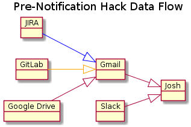
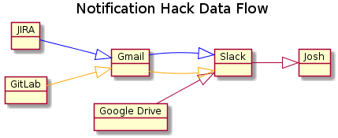
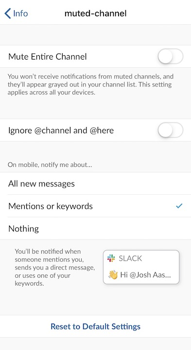
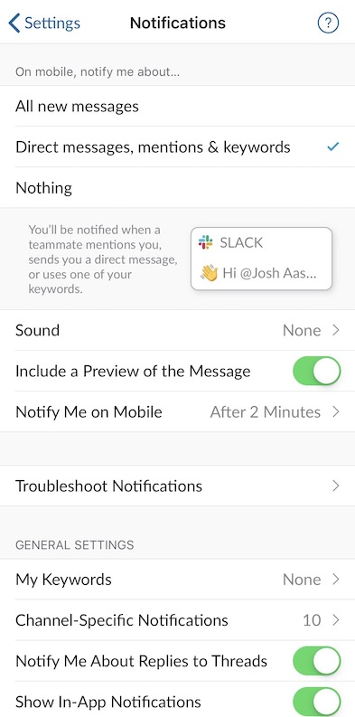
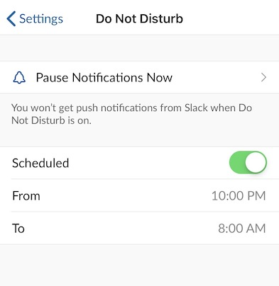
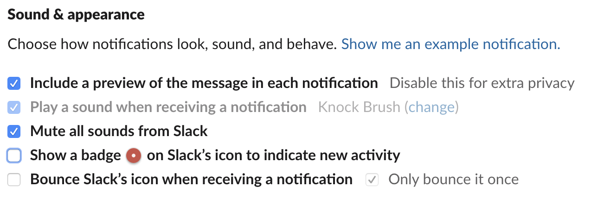
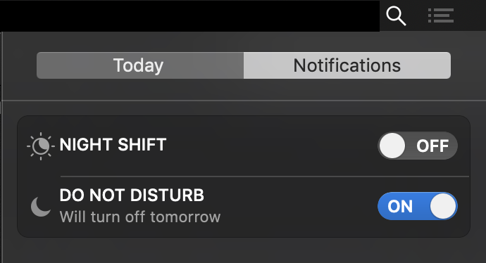

How I manage my notifications at work to minimize context switching, remove redundancy, and reduce noise, so I can focus on more impactful tasks.

> NOTE I no longer use this work setup, as I am looking for [new opportunities](https://www.linkedin.com/in/josh-aaseby).  Assuming my next job doesn’t have managing notifications solved, I plan to use some of the learnings shared here to help protect my time.  

In this [Age of distraction](https://www.independent.co.uk/life-style/gadgets-and-tech/features/age-of-distraction-why-the-idea-digital-devices-are-destroying-our-concentration-and-memory-is-a-a6689776.html), [The Culture Of Impatience And Instant Gratification](https://studybreaks.com/culture/instant-gratification/,),  [fomo](https://en.wikipedia.org/wiki/Fear_of_missing_out,) notifications coming from every device  (often the same notification) and manifestos on [Focus](http://focusmanifesto.s3.amazonaws.com/FocusFree.pdf])  (see Section 2.2) there is a lot of debate around distractions… but i’m not here to talk about societal issues. I’m here to tell you something you already know. There are a lot of notifications. Ok, well, more specifically I’m going to tell you how _I_ manage notifications at work.

Managing these notifications can be pivotal to making sure you are spending your time wisely. Not every notification is of equal value and it vital that we use tools to help us manage and prioritize when we are notified, where we are notified and more important, if we are notified.

> "The people that work for you need to get into flow. Anything that keeps them from it will reduce their effectiveness." - Peopleware (summarized nicely [here](https://medium.com/software-development/the-people-that-work-for-you-need-to-get-into-flow-peopleware-4ad5d64b1467))  

## Usual Suspects
Of all the tools I use at the work the main culprits for notifications are JIRA, Google Docs, GitLab, Slack.  Represented as a diagram, this is the flow of notifications:


Let me run through each tool and the notifications I receive and the notifications I act on.

### Google Docs 
I’d be here forever if I listed everything for which we use Google Docs. I mean, you can use as a pseudo cloud database, if you had the business requirements (or the moxie) that matched. Let me get hand-wavy and say we use Google Docs as a way to collaborate on business requirements. I get notifications when a document is shared, someone comments on a doc of mine or I get assigned/mentioned in a comment. I act on document shares (usually just a drive-by and then I add it to a queue) and mentions in comments. All of these notifications are emails that I receive in Gmail.

### GitLab
Few people may have been surprised on this one. The reason I get many notifications from Gitlab is that I am in the many approvers groups we use to approve merge requests. This is just my way to keep a pulse on what code is shipping, while I do tech leady things (don’t worry I am in the acceptance phase, not the bargaining of knowing that 80% of my time doesn’t go into coding full-time). So I get notifications when merge requests are created, changes are pushed, comments are made, mentions are made and a few more. I act on merge requests being created, mentions and responses to my comments. All of these notifications are emails that I receive in Gmail. We have a self-hosted GitLab solution

### JIRA
We use JIRA for issue & project tracking. As a tech lead I spend more time in this tool than I’d care to admit. I get notifications for updated tasks (status changes), comments on tasks, mentions in tasks, etc. I act on notifications assigned to me, comments on tasks, mentions and created tasks. The last of which will largely go ignored in this article. All of these notifications are emails that I receive in Gmail. We have a self-managed JIRA solution.

### Slack
It’s Slack.

## All roads lead to…
So what am I to do? Keep toggling back and forth? Do I want to keep two different notification centers (I use that term liberally to try to emphasize a point). That wouldn’t be much of a post would it? We’re here to try to solve problems, not just point them out.

Given that Slack has the vast majority of notifications, I spend quite a bit of time in there already, and it has (arguably) the most integrations, I set out to send the notifications I need to Slack. Towards the end of this I’ll share some ways I manage Slack notifications.

I tried out a few various bots to aid in this adventure, which I’ll mention with each tool, but, ultimately, I ended up using the Google Drive bot and Gmail’s filter-then-forward functionality to send emails to Slack. 


(Not pictured is the fact I still check Gmail for _other_ emails)

## Get Notifications to Slack
### Google Drive

#### Google Drive for Slack
The Google Drive bot will notify you of shared files, comments, assignments, and more. Beyond notifications, I enjoy that the bot allows me to respond to comments from within Slack itself and modify file permissions of shared documents.

See [Google Drive for Slack > Set up the Google Drive app](https://get.slack.help/hc/en-us/articles/205875058-Google-Drive-for-Slack) for directions

Note: Your Slack Administrator needs to enable this bot

#### Filter Google Drive Emails
The Google Drive bot has all the notifications I need, but what about those emails that are still sent? I don’t want to see notifications in two places. I need to create two filters; one for comments, the other for shared docs.

##### Comments Filter
In Gmail

1. Start creating a filter
2. Enter `comments-noreply@docs.google.com` in `From`
3. Select `Create Filter`
4. Check `Skip the Inbox (Archive It)`
5. Select `Create Filter`

##### Shared Docs Filter
In Gmail

1. Start creating a filter
2. Enter `drive-shares-noreply@google.com` in `From`
3. Select `Create Filter`
4. Check `Skip the Inbox (Archive It)`
5. Select `Create Filter`

### Slack Email
For GitLab and JIRA, you will need to setup a [Slack Forwarding Email](https://slack.com/intl/en-au/slack-tips/send-email-to-slack). Email sent (or in our case, specifically forwarded) to the Slack Forwarding Email will appear in your account's Slackbot.

### Gitlab
First, if you are or know a Gitlab admin, there is a [Gitlab/Slack integration](https://docs.gitlab.com/ee/user/project/integrations/slack.html). If you aren’t an admin or don’t know an admin (that will or can’t help you), do the following:

In Gmail

1. Start creating a filter
2. Enter `gitlab@REPLACE_WITH_YOUR_DOMAIN` in `From`
3. Select `Create Filter`
4. Check `Skip the Inbox (Archive It)`
5. Check `Forward it to:` and select your Slack forwarding address
6. Select `Create Filter`

### JIRA
In Gmail

1. Start creating a filter
2. Enter `jira@REPLACE_WITH_YOUR_DOMAIN` in `From`
3. Enter `mentioned you on` in `Subject`
4. Select `Create Filter`
5. Check `Skip the Inbox (Archive It)`
6. Check `Forward it to:` and select your Slack forwarding address
7. Select `Create Filter`

## Tame Slack Notifications
Now that we have our notifications funneling through Slack, unsurprisingly Slack has even more notifications. There are a few things we can do to reduce the noise and make some notifications a pull, rather than a push.

### Channel Level

#### Leave the Channel
Leaving a channel would be the best course of action to reduce notifications from that channel.  If you are worried you may lose track of the channel, just do what I did and start a spreadsheet that has the channel name and any relevant notes for the channel.

#### Channel Notifications
Often you don’t have that luxury and have to stay in the channel (you only need to check the channel occasionally, it is private and you couldn’t get back in, optics, etc.). Staying in that channel doesn’t mean you have to deal with it fighting for your attention. We can simply mute the channel.

Here is an example of the channel settings in Slack iOS:

(That’s right, I created a channel called `muted-channel`. i didn’t have the heart to use one of the product channels I had muted. I kid, I kid)

`Mentions or keywords` on mobile is the most I set for a channel. More often than not I choose `Nothing`.  Note that if you `Mute Entire Channel` or `Ignore @`s that applies to desktop and mobile.

### Application Level
It isn’t hard to imagine how going through each channel won’t scale. Thankfully there are a few things you can do application levels to manage notifications.

#### Slack iOS App

##### Notifications
In Notifications settings, similar to the Channel Level settings, you can set what to be notified about, as well as when and how.


##### Do Not Disturb
In Do Not Disturb, you can pause notifications and schedule a period to not be notified.


#### Slack Desktop Preferences
On Desktop, I  `Mute all the sounds from Slack`, hide the badge, and disable the bounce (isn’t cute anymore).


#### iOS Slack Settings
In Settings, under Slack Notifications, I only show alerts in Notification Center and disable Sounds. I go back and forth on whether to show the badge. When I go on vacations `Allow Notifications` is set to off.


### Device Level
#### iOS
I have Do Not Disturb scheduled on my phone from 10 PM to 7 AM (local time). This Do Not Disturb applies to all applications. You can manage Do Not Disturb in Settings > Do Not Disturb. Apple Support has all the information you should need in [Use Do Not Disturb on your iPhone, iPad, and iPod touch - Apple Support](https://support.apple.com/en-us/HT204321).

#### macOS
When working on my laptop, I turn on `DO NOT DISTURB` when I start focus work. I don’t schedule Do Not Disturb on my laptop, because I do my best not to be on laptop after hours.


## Known issues
* Sometimes google drive bot disconnects
	* That’s why I don’t mark things as read in the email filter (but isn’t all unread the same as all read?)
* Slackbot can easily become a dumping ground. 
	* Yup. That’s what your inbox used to be.  If you wanted, you could setup an email address for separate channels using [Send emails to Slack | Slack](https://slack.com/intl/en-gb/help/articles/206819278-Send-emails-to-Slack#set-up-email-forwarding).
* Some of these filters could be manages by bots. 
	* Yes and no. Some don’t meet my specific needs (security, filtering, etc) and some cost money. I wanted to just be pragmatic, use a tool I knew that fit the bill and not write my own bots (I have more interesting work projects and side projects).
* Sometimes you can get lost in work and forget about checking notifications 
	* That is kind of the point, but be mindful, you should still be an integrated member of the team
* The filters could be a lot more fine grained.
	* If you look at the notifications I get, what I act on and what is forwarded by the filters I still get more alerts than I need. I can say I have that as follow up as i keep iterating ("we’re never finished" 🙄). In the meantime,  I’ve erred on the side of caution. 

## Appendix
### Slack Bots
If you are unfamiliar with Slack bots, I’d recommend checking out [Enabling interactions with bots](https://api.slack.com/bot-users).

### Gmail Filters
If you are unfamiliar with Gmails filter-then-forward functionality, I’d recommend checking out the post [How to Forward Gmail Email Using Filters](https://www.lifewire.com/how-to-forward-gmail-email-using-filters-1171934).

#### Start Creating a filter
For the source of truth on the matter of creating filters go to Google Support, [Create rules to filter your emails](https://support.google.com/mail/answer/6579?hl=en).

##### Via Search
In Gmail

1. Find the search bar at the top of nearly every Gmail page
2. Select the down-pointing triangle, tooltip `Show search options`

##### Via Settings
In Gmail

1. Select the button toward the top-right with the gear icon, tooltip `Settings` 
2. Select the `Settings` menu item (that’s not confusing)
3. Select the tab `Filters and Blocked Addresses`
4. Select `Create a new filter`

### Device Do Not Disturb iOS Exceptions
Do Not Disturb at the device level on your phone is great, but what if your job duties depend on you replying to on call notifications (or you have love ones you want to be able to get a hold of you)? I allow Favorites to contact me when I have Do Not Disturb on and (sigh) I have PagerDuty in my Favorites for the on call situation.

You can get the PagerDuty numbers from [PagerDuy](https://support.pagerduty.com/docs/notification-phone-numbers#section-pagerduty-vcard)

### Notification Hack Data Flow PUML
```
@startuml

title Pre-Notification Hack Data Flow

left to right direction

object `JIRA` as jira
object `GitLab` as gitlab
object `Slack` as slack
object `Gmail` as gmail
object `Google Drive` as drive 
object `Josh` as josh

jira —|> gmail #00F
gitlab —|> gmail #FFA500
drive —|> gmail
gmail —|> josh
slack —|> josh

@enduml
```
```
@startuml

@startuml

title Notification Hack Data Flow

left to right direction

object `JIRA` as jira
object `GitLab` as gitlab
object `Slack` as slack
object `Gmail` as gmail
object `Google Drive` as drive 
object `Josh` as josh

jira —|> gmail #00F
gitlab —|> gmail #FFA500
drive —|> slack
gmail —|> slack #FFA500
gmail —|> slack #00F
slack —|> josh

@enduml
```
